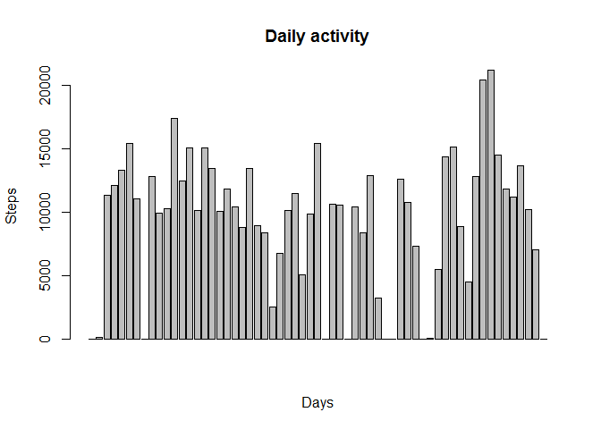
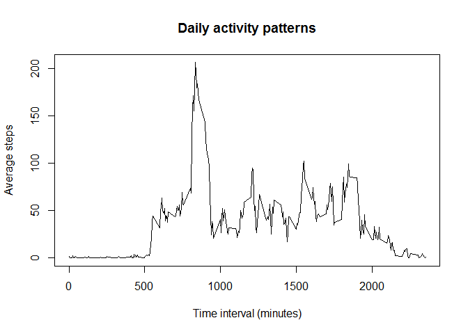
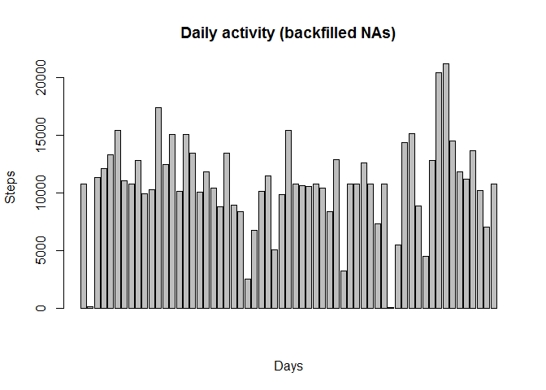
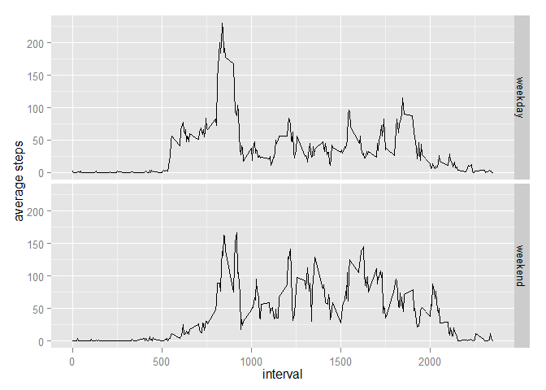

# Reproducible Research: Peer Assessment 1
 

#Peer assignment 1

## Loading and pre-processing the data

```r
library(dplyr) # install.packages("dplyr") if you don't have this library on your system
```

```
## 
## Attaching package: 'dplyr'
## 
## The following object is masked from 'package:stats':
## 
##     filter
## 
## The following objects are masked from 'package:base':
## 
##     intersect, setdiff, setequal, union
```

```r
library(lubridate) # to manipulate the date
library(ggplot2) # to draw some of the plots

# Replace the following with the correct folder on your machine
setwd("C:\\Users\\G\\SkyDrive\\Documents\\Coursera\\Reproducible research")

url="https://d396qusza40orc.cloudfront.net/repdata%2Fdata%2Factivity.zip"
urlfile = "activity.zip"
file="activity.csv"

# download the file if you don't already have it in your working directory
if (!file.exists(urlfile))
  download.file(url, destfile=urlfile)

# unzip the file if you haven't already done so in your working directory
if (!file.exists(file)) {
  unzip(urlfile)
}

mydata <- read.csv(file)
```

## What is the mean total number of steps taken per day?

```r
# Aggregate teh data by date
dailytotals<- summarise(group_by(mydata, date), total=sum(steps, na.rm=T))
barplot(dailytotals$total, main="Daily activity", xlab="Days", ylab="Steps")
```

 

Computing the daily mean and median values is straightforward:

```r
dailymean<-mean(dailytotals$total)
dailymedian<-median(dailytotals$total)
```
The mean value for the daily steps **dailymean** is **9354.2295082**.

The median value **dialymedian** is **10395**.

##  What is the average daily activity pattern?
Here is how to generate the plot for the average number of steps for each time interval of a day:

```r
interval.average<- summarise(group_by(mydata, interval), average=mean(steps, na.rm=T))
plot(y=interval.average$average, x=interval.average$interval, type="l", main="Daily activity patterns", xlab="Time interval (minutes)", ylab="Average steps")
```

 

The time interval with the most steps, on average:

```r
mydata[which(interval.average$average==max(interval.average$average)), "interval"]
```

```
## [1] 835
```

## Inputing missing values
The number of missing values in the dataset:

```r
sum(is.na(mydata$steps))
```

```
## [1] 2304
```

We're going to fill these missing values with the mean for that interval, calculated across the days in the dataset. The mean for the interval is already stored in the data frame **interval.average**

```r
# add a column showing the mean for that time interval
backfilleddata<- inner_join(mydata, interval.average, by=c("interval"))

# replace the "steps" value with the mean for all NAs.
backfilleddata$steps<- ifelse(is.na(backfilleddata$steps), backfilleddata$average, backfilleddata$steps) 

# Aggregate the data by date
backfilledtotals<- summarise(group_by(backfilleddata, date), total=sum(steps, na.rm=T))

barplot(backfilledtotals$total,main="Daily activity (backfilled NAs)", xlab="Days", ylab="Steps")
```

 

```r
newdailymean <- mean(backfilledtotals$total)
newdailymedian <- median(backfilledtotals$total)
```
 
The new mean for total steps per day **newdailymean** is:

```r
as.numeric(format(newdailymean, digits=2, nsmall=2))
```

```
## [1] 10766.19
```

The new median for total steps per day **newdailymedian** is:

```r
newdailymedian
```

```
## [1] 10766.19
```
The mean and median are greater than the ones calculated before filling the imputed NAs.


## Are there differences in activity patterns between weekdays and weekends?

```r
backfilledtotals<- backfilleddata %>% 
  rename(mydate=date) %>% 
  mutate(weekdayflag = ifelse(weekdays(ymd(mydate)) %in% c("Sunday", "Saturday"), "weekend", "weekday")) %>% 
  select(-average)

backfilledaggregates <- summarise(group_by(backfilledtotals, interval, weekdayflag), average=mean(steps, na.rm=TRUE))


qplot(interval, average, data=backfilledaggregates, facets=weekdayflag~., geom="line", ylab="average steps")
```

 
Notice the difference in the patterns between weekends and weekdays: weekdays have a sharper incline around the morning rush hour, and relatively lower activity during the afternoons, when compared to weekdays.
